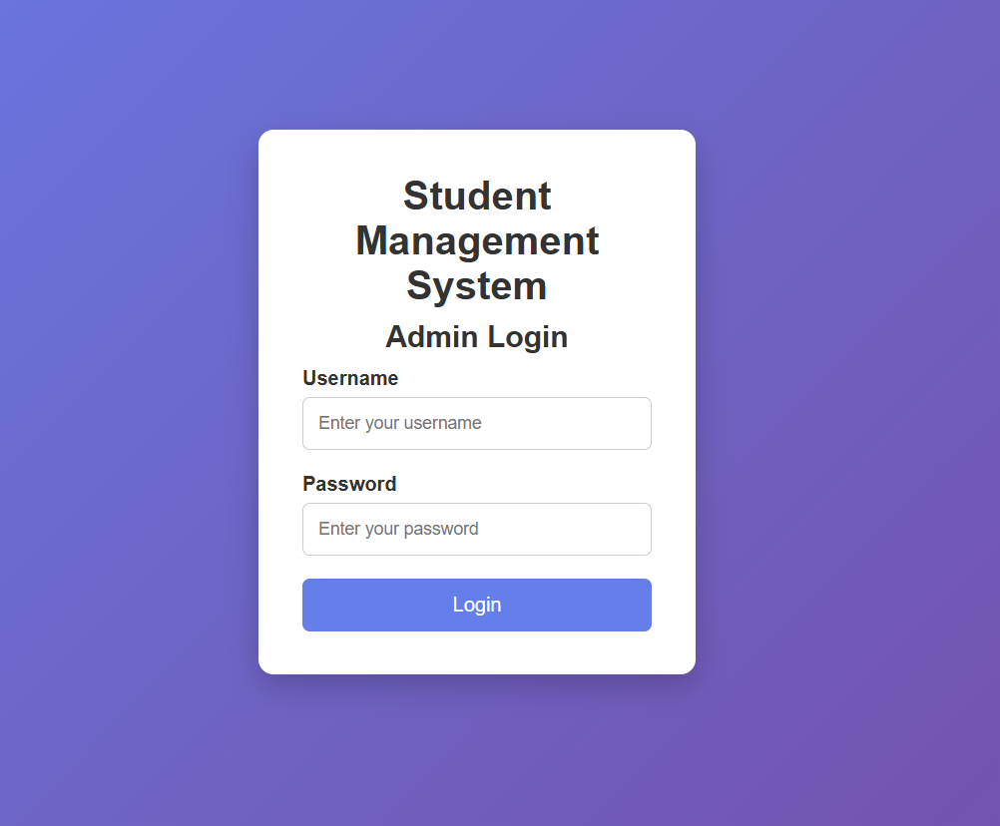
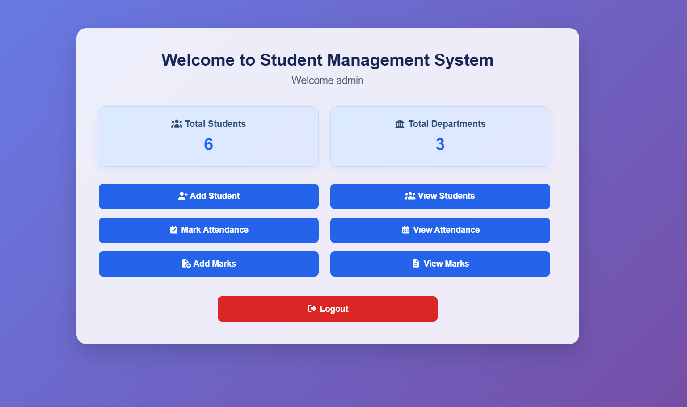
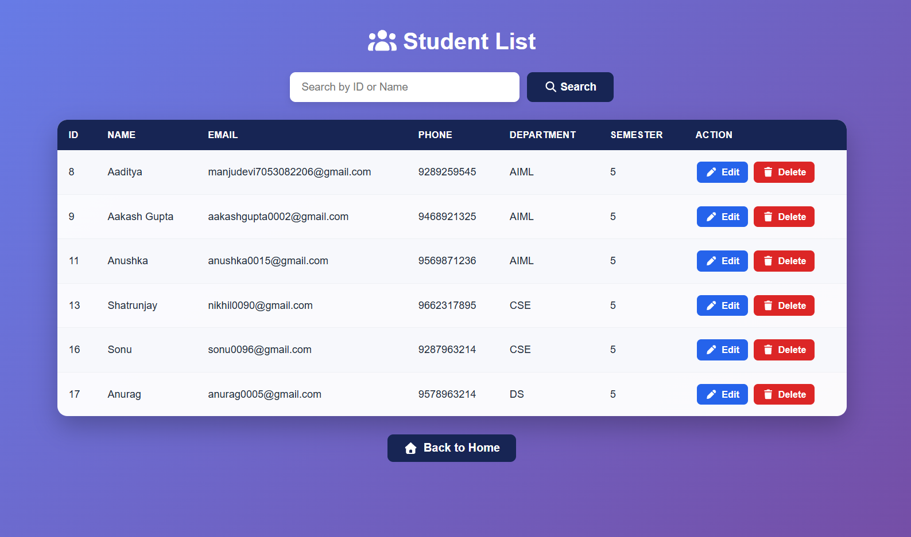
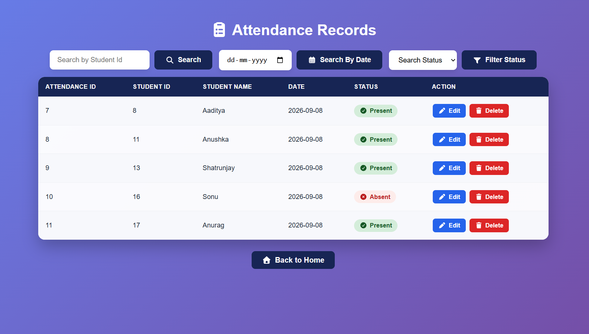
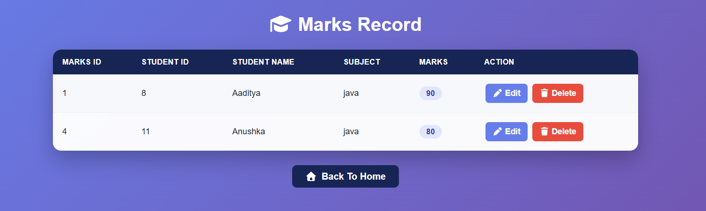

# Student Management System

A Java-based web application for managing student records, attendance, and marks through an admin dashboard.

## Project Overview

The Student Management System is a database-driven web application that allows administrators to manage student information efficiently. It provides student record management, attendance tracking, marks management, authentication, search functionality, and MySQL database integration.
## Features

- Admin Login
- Admin Dashboard
- Admin Logout
- Add Student
- View Student Records
- Update Student Details
- Delete Student Records
- Search Students by Student ID, Name, or Department
- Attendance Management
- Add and View Attendance Records
- Edit Attendance Records
- Marks Management
- Add and View Student Marks
- Edit Marks Records
- Session-based Admin Authentication
- Student Statistics
- MySQL Database Integration
## Technologies Used

- Java
- JSP
- Java Servlets
- JDBC
- MySQL
- HTML
- CSS
- Apache Tomcat
- Eclipse IDE
- MySQL Workbench
## Project Structure

```text
src/main
├── java
│   ├── controller
│   ├── dao
│   ├── model
│   └── util
│
└── webapp
    ├── JSP files
    ├── CSS files
    └── WEB-INF
```
## Database

The application uses MySQL for storing and managing student, admin, attendance, and marks information.

### Main Database Tables

- `student` — Stores student information
- `admin` — Stores administrator login information
- `attendance` — Stores student attendance records
- `marks` — Stores student marks
## How to Run

1. Clone the repository.
2. Import the project into Eclipse IDE.
3. Configure Apache Tomcat 11.
4. Create and configure the MySQL database.
5. Update the database connection settings.
6. Set the `DB_PASSWORD` environment variable with your MySQL password.
7. Start the Tomcat server.
8. Open the application in a web browser.
## Security

- Database credentials are not stored directly in the source code.
- The MySQL password is provided through the `DB_PASSWORD` environment variable.
- Session-based authentication is used to protect admin functionality.
- Password debug output is not included in the application.
## Project Purpose

This project was developed to gain practical experience in Java web development, database connectivity, CRUD operations, authentication, attendance and marks management, and database-driven application development.
It demonstrates the use of Java Servlets, JSP, JDBC, MySQL, and Apache Tomcat to build a practical web application.

## Screenshots

### Login Page


### Admin Dashboard


### Student Management


### Attendance Management


### Marks Management

